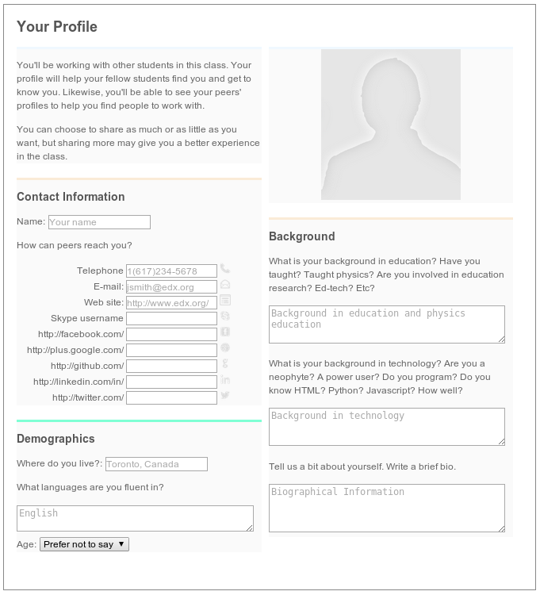

ProfileXBlock
=============

This is an XBlock which allows students to maintain per-course user
profiles. Per-course user profiles allow students to give information
relevant to a course. For example, in a course on teaching physics,
the students could give information about whether they've taught
physics, done education research, or just have a general interest,
e.g. as parents. 

This concept is inspired by the way profiles work for
[meetups](http://www.meetup.com/), as well as NovoEd. 

As of this writing (Jul 29, 2014), this XBlock is unfinished, but I am
actively developing it. For example, 

* There is a JSON configuration language, but the configuration is
  hard-coded in the XBlock
* The list of contact information (Facebook, etc.) is ugly
* There is no way for students to view each others' profiles
* Is there a better way to handle phone number (esp. regarding country codes?)
* How should we phrase open-ended questions so we get clear,
  consistent answers?
* Will users find the number of contact info input fields
  overwhelming or privacy-invading?

This README file probably won't be updated often (specifically, not
until the XBlock is done). Odds are, by the time you read this, a few
of these will be fixed, and a few will still be outstanding (in
particular, ones where we run into rough edges with the XBlocks
architecture, where it makes sense to fix XBlocks rather than hacking
around).

